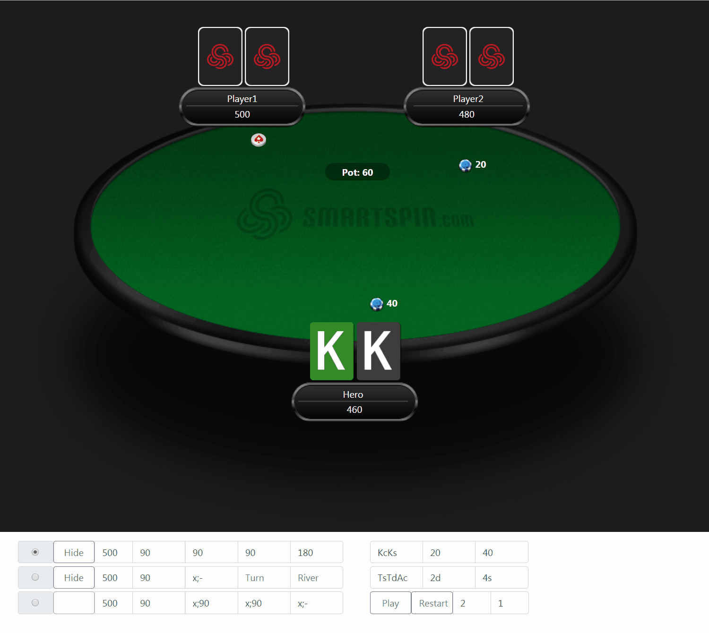

# Quizz maker for Smart Spin ltd
 
https://grimowsky.github.io/ss-quizz-maker/

# Instructions:

- Radio buttons selects Player on the button (preflop and postflop action determinant)
- Stacks input - input allows to set up stack sizes (how many chips in hands has Player)
- Preflop input - integer numbers separated by ; - provides player bets
- Flop/Turn/River - integer number separated by ; - provides postflop bets

- Hero Cards input:
- f.e  KcKd -> where K stands for King, c stands for clubs (color of the card)
- SB/BB - input for blinds - f.e 20/40

**Flop/Turn/River:**

Cards to be dealt on the Flop/Turn/River: fe flop: TdKsJh - Ten of diamond, King of spades, Jack of hearts

Play/Restart buttons - Play generates actions, Restart restarts it.

# Input order:

*1)* Blinds
*2)* Stacksizes
*3)* Preflop/Postflop actions*
*4)* Flop/Turn/River

# Actions (Preflop/Postflop) options:
	
- *x* stands for check, for example x;180 will be check/bet(or raise) 180
- *integer* stands for bet(raise) size or call if = previous Player bet
- '*-*' stands for fold, f.e: x;- will be check/fold action

* if not provided Preflop - replay will not start. Replay stops on first empty action input

Demo:

			
